# Use Case Diagram - AirBnB Clone Backend

---

## 📋 Overview

This directory contains the use case diagram for the AirBnB Clone backend system, visualizing the interactions between different actors (users) and the system functionalities.

---

## 👥 Actors

### Primary Actors
1. **Guest** - User who books properties
2. **Host** - User who lists properties
3. **Admin** - System administrator

### Secondary Actors
4. **Payment System** - External payment gateway (Stripe, PayPal)
5. **Email Service** - External email notification service

---

## 🎯 Use Cases by Actor

### Guest Use Cases
- Register Account
- Login/Logout
- Search Properties
- View Property Details
- Book Property
- Make Payment
- Cancel Booking
- Write Review
- Send Message to Host
- Manage Profile
- View Booking History

### Host Use Cases
- Register Account
- Login/Logout
- Create Property Listing
- Edit Property Listing
- Delete Property Listing
- Manage Availability
- View Bookings
- Accept/Decline Booking Request
- Respond to Reviews
- Send Message to Guest
- Manage Profile
- View Earnings
- Request Payout

### Admin Use Cases
- Login/Logout
- Manage Users (View, Suspend, Delete)
- Manage Properties (Approve, Suspend, Delete)
- Manage Bookings (View, Cancel)
- View Payments
- Process Refunds
- Generate Reports
- Manage Platform Settings
- View Analytics Dashboard

### System Use Cases (Automated)
- Send Email Notifications
- Process Payments
- Calculate Booking Prices
- Update Property Availability
- Generate Invoices

---

## 🔗 Use Case Relationships

### Include Relationships (Required)
- **Book Property** includes **Make Payment**
- **Register Account** includes **Send Verification Email**
- **Make Payment** includes **Process Payment**
- **Cancel Booking** includes **Process Refund**

### Extend Relationships (Optional)
- **Search Properties** extends to **Filter by Location**
- **Search Properties** extends to **Filter by Price**
- **View Property Details** extends to **View Reviews**
- **View Property Details** extends to **View on Map**

### Generalization (Inheritance)
- **Host** is a specialized type of **Guest** (can do everything Guest can do + Host features)

---

## 📊 Mermaid Diagram Reference

Use this structure to create your Draw.io diagram:

```mermaid
graph TB
    %% Actors
    Guest([Guest])
    Host([Host])
    Admin([Admin])
    PaymentSystem([Payment System])
    EmailService([Email Service])
    
    %% Guest Use Cases
    Register[Register Account]
    Login[Login/Logout]
    SearchProps[Search Properties]
    ViewProp[View Property Details]
    BookProp[Book Property]
    MakePayment[Make Payment]
    CancelBook[Cancel Booking]
    WriteReview[Write Review]
    SendMsg[Send Message]
    ManageProfile[Manage Profile]
    ViewBookings[View Booking History]
    
    %% Host Use Cases
    CreateList[Create Property Listing]
    EditList[Edit Property Listing]
    DeleteList[Delete Property Listing]
    ManageAvail[Manage Availability]
    ViewHostBookings[View Bookings]
    AcceptBooking[Accept/Decline Booking]
    RespondReview[Respond to Reviews]
    ViewEarnings[View Earnings]
    RequestPayout[Request Payout]
    
    %% Admin Use Cases
    ManageUsers[Manage Users]
    ManageProps[Manage Properties]
    ManageBookings[Manage All Bookings]
    ViewPayments[View Payments]
    ProcessRefund[Process Refunds]
    GenReports[Generate Reports]
    ManageSettings[Manage Platform Settings]
    ViewAnalytics[View Analytics]
    
    %% System Use Cases
    SendEmail[Send Email Notifications]
    ProcessPay[Process Payments]
    CalcPrice[Calculate Prices]
    UpdateAvail[Update Availability]
    
    %% Guest Connections
    Guest --> Register
    Guest --> Login
    Guest --> SearchProps
    Guest --> ViewProp
    Guest --> BookProp
    Guest --> MakePayment
    Guest --> CancelBook
    Guest --> WriteReview
    Guest --> SendMsg
    Guest --> ManageProfile
    Guest --> ViewBookings
    
    %% Host Connections (Host can do all Guest actions plus Host-specific)
    Host --> CreateList
    Host --> EditList
    Host --> DeleteList
    Host --> ManageAvail
    Host --> ViewHostBookings
    Host --> AcceptBooking
    Host --> RespondReview
    Host --> ViewEarnings
    Host --> RequestPayout
    Host --> SearchProps
    Host --> ManageProfile
    
    %% Admin Connections
    Admin --> ManageUsers
    Admin --> ManageProps
    Admin --> ManageBookings
    Admin --> ViewPayments
    Admin --> ProcessRefund
    Admin --> GenReports
    Admin --> ManageSettings
    Admin --> ViewAnalytics
    
    %% External System Connections
    MakePayment -.-> PaymentSystem
    ProcessPay -.-> PaymentSystem
    Register -.-> EmailService
    SendEmail -.-> EmailService
    
    %% Include Relationships
    BookProp -.includes.-> MakePayment
    Register -.includes.-> SendEmail
    MakePayment -.includes.-> ProcessPay
    CancelBook -.includes.-> ProcessRefund
    
    %% System Interactions
    BookProp --> CalcPrice
    BookProp --> UpdateAvail
    RequestPayout --> ProcessPay
```



---

## 🎨 Draw.io Creation Guide

### Step 1: Setup Canvas
1. Open https://app.diagrams.net/
2. Create new diagram
3. Select "Blank Diagram"
4. Name: `airbnb-use-case-diagram`

### Step 2: Add Actors (Stick Figures)
From the **UML** shape library:
1. Add 3 **Actor** shapes (stick figures) on the LEFT side:
   - Guest (top)
   - Host (middle)
   - Admin (bottom)

2. Add 2 **Actor** shapes on the RIGHT side:
   - Payment System
   - Email Service

### Step 3: Draw System Boundary
1. Insert a large **Rectangle** in the center
2. Label it: "AirBnB Clone Backend System"
3. Style: Rounded corners, light gray fill

### Step 4: Add Use Cases (Ovals)
Inside the system boundary, add **Ellipse** shapes for each use case:

**Guest Section (Top):**
- Register Account
- Login/Logout
- Search Properties
- View Property Details
- Book Property
- Make Payment
- Cancel Booking
- Write Review
- Send Message
- Manage Profile
- View Booking History

**Host Section (Middle):**
- Create Property Listing
- Edit Property Listing
- Delete Property Listing
- Manage Availability
- View Bookings
- Accept/Decline Booking
- Respond to Reviews
- View Earnings
- Request Payout

**Admin Section (Bottom):**
- Manage Users
- Manage Properties
- Manage All Bookings
- View Payments
- Process Refunds
- Generate Reports
- Platform Settings
- View Analytics

### Step 5: Connect Actors to Use Cases
Use **solid lines** from actors to their use cases:

**Guest connections (11 lines):**
- Guest → Register Account
- Guest → Login/Logout
- Guest → Search Properties
- Guest → View Property Details
- Guest → Book Property
- Guest → Make Payment
- Guest → Cancel Booking
- Guest → Write Review
- Guest → Send Message
- Guest → Manage Profile
- Guest → View Booking History

**Host connections (13 lines):**
Host can do Guest actions plus:
- Host → Create Property Listing
- Host → Edit Property Listing
- Host → Delete Property Listing
- Host → Manage Availability
- Host → View Bookings
- Host → Accept/Decline Booking
- Host → Respond to Reviews
- Host → View Earnings
- Host → Request Payout
- Host → Search Properties (shared with Guest)
- Host → Manage Profile (shared with Guest)

**Admin connections (8 lines):**
- Admin → Manage Users
- Admin → Manage Properties
- Admin → Manage All Bookings
- Admin → View Payments
- Admin → Process Refunds
- Admin → Generate Reports
- Admin → Platform Settings
- Admin → View Analytics

### Step 6: Add Relationships

**«include» relationships (dashed arrows with «include»):**
- Book Property --«include»--> Make Payment
- Register Account --«include»--> Send Email Notification
- Make Payment --«include»--> Process Payment
- Cancel Booking --«include»--> Process Refund

**«extend» relationships (dashed arrows with «extend»):**
- Filter by Location --«extend»--> Search Properties
- Filter by Price --«extend»--> Search Properties
- View Reviews --«extend»--> View Property Details

**External System connections (dashed lines):**
- Make Payment -----> Payment System (actor)
- Send Email -----> Email Service (actor)

### Step 7: Style the Diagram

**Colors:**
- Actors: Default (no fill)
- Use cases: White fill, black border
- System boundary: Light gray (#F5F5F5)
- Include arrows: Dashed with «include» label
- Extend arrows: Dashed with «extend» label
- Actor connections: Solid black lines

**Text:**
- Title: 18pt Bold
- Actor names: 12pt Regular
- Use case names: 10pt Regular
- Relationship labels: 9pt Italic

### Step 8: Export
1. File → Export as → PNG
2. Settings:
   - Resolution: 300 DPI
   - Border: 20px
   - Transparent background: No
3. Save as: `use-case-diagram.png`
4. Also save: `use-case-diagram.drawio`

---

## 📐 Diagram Layout

```
┌─────────────────────────────────────────────────────────────────────┐
│           AirBnB Clone Backend - Use Case Diagram                   │
└─────────────────────────────────────────────────────────────────────┘

    Guest                ┌────────────────────────────────────┐          Payment
      👤  ────────────> │                                    │ <───────  System
      │                 │     AirBnB Clone Backend System    │             💳
      │                 │                                    │
      │                 │  ┌──────────────┐  ┌───────────┐  │
      └────────────────>│  │   Register   │  │   Login   │  │
                        │  │   Account    │  │  /Logout  │  │
                        │  └──────────────┘  └───────────┘  │
                        │                                    │
                        │  ┌──────────────┐  ┌───────────┐  │
    Host                │  │    Search    │  │   Book    │  │
      👤  ────────────> │  │  Properties  │  │ Property  │  │
      │                 │  └──────────────┘  └───────────┘  │
      │                 │                                    │
      │                 │  ┌──────────────┐  ┌───────────┐  │          Email
      └────────────────>│  │   Create     │  │   Make    │  │ <───────  Service
                        │  │   Listing    │  │  Payment  │  │             📧
                        │  └──────────────┘  └───────────┘  │
                        │                                    │
    Admin               │  ┌──────────────┐  ┌───────────┐  │
      👤  ────────────> │  │   Manage     │  │  Process  │  │
                        │  │    Users     │  │  Refunds  │  │
                        │  └──────────────┘  └───────────┘  │
                        │                                    │
                        └────────────────────────────────────┘
```

---

## ✅ Checklist for Draw.io Diagram

Before exporting, verify:

- [ ] All 3 primary actors are present (Guest, Host, Admin)
- [ ] All 2 secondary actors are present (Payment System, Email Service)
- [ ] System boundary box is clearly visible
- [ ] At least 30 use cases are included
- [ ] All Guest use cases are connected (11 connections)
- [ ] All Host use cases are connected (13 connections)
- [ ] All Admin use cases are connected (8 connections)
- [ ] «include» relationships are marked with dashed arrows
- [ ] «extend» relationships are marked with dashed arrows
- [ ] External system connections are present
- [ ] Diagram is well-organized and readable
- [ ] No overlapping elements
- [ ] Professional appearance
- [ ] Exported as high-quality PNG

---

## 📊 Use Case Summary

| Actor | Number of Use Cases | Key Responsibilities |
|-------|---------------------|---------------------|
| **Guest** | 11 | Browse and book properties, make payments, write reviews |
| **Host** | 13 (includes Guest) | Manage property listings, handle bookings, receive payouts |
| **Admin** | 8 | Platform management, user/property moderation, analytics |
| **Payment System** | 2 interactions | Process payments and payouts |
| **Email Service** | 2 interactions | Send notifications and verification emails |

**Total Use Cases:** 30+  
**Total Relationships:** 35+ connections

---

**Last Updated:** October 26, 2025  
**Status:** Mermaid reference created - Draw.io diagram pending

